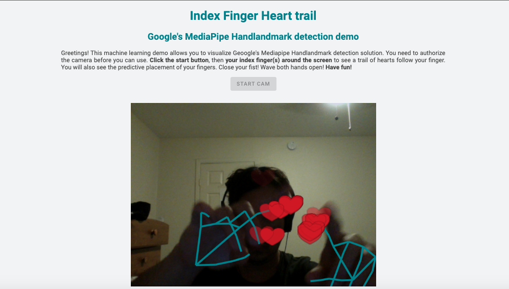

# ML-Finger-Trails

## Description

This page is an example of Google's Mediapipe Solutions. The library is bult on top of TensorFlow Lite. It uses the hand landmark detection features to create a trail of hearts around the index finger. 

## Table of Contents

- [Installation](#installation)
- [Usage](#usage)
- [ScreenShot](#screenshot)
- [License](#license)
- [Contributing](#contributing)
- [Tests](#tests)

## Installation

N/A

## Usage

It is meant to be viewed online. You must allow access to your camera!

## ScreenShot

## License

This project is covered under the following: MIT License

## Contributing

Submit a GitHub Issue.

## Tests

N/A
